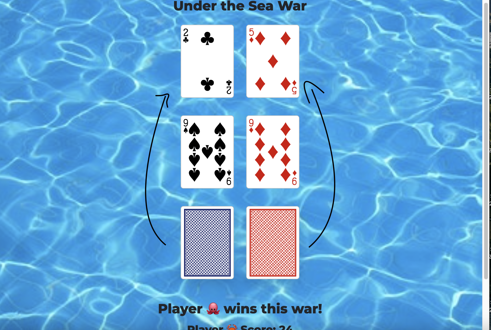

Under the Sea War
Instructions
The game of war is one where you try to beat your opponents with the luck of the cards.  Each person draws a card and whoever has the higher value wins that round and gets both cards. The name of the game comes in when the players tie and have what is termed as a “war.” Whoever wins the war gets all four cards.
Here is the game!

Why I chose it:
Growing up, my family would take a lot of two week vacations across the country in our van.  That meant a lot of freetime for my sister and I to play games.  One of the games that was easier to play in the van was war.  War can also take a bit of time to play so it was also a good time waster when sitting in the car for hours on end. I’ve also always liked the simplicity of War and that it is easy to teach to others.

When you click draw, the first card will flip from each deck and these two cards will compete.

The winner is whoever has a higher card value.  

If the two cards drawn are tied, then each player draws another card from the top of their deck.  Whoever has the higher value card from that wins all four cards.

Technologies Used:
JavaScript, HTML, CSS

Things to add in the future:
Better animations
More creative layout
Hide the war pile until it is used
Include audio
Add more “splash” to the cards
